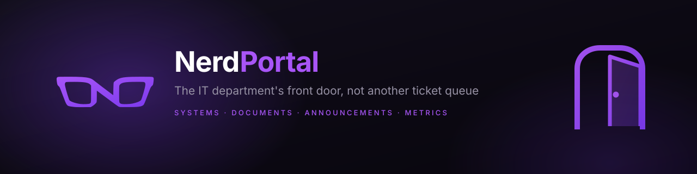
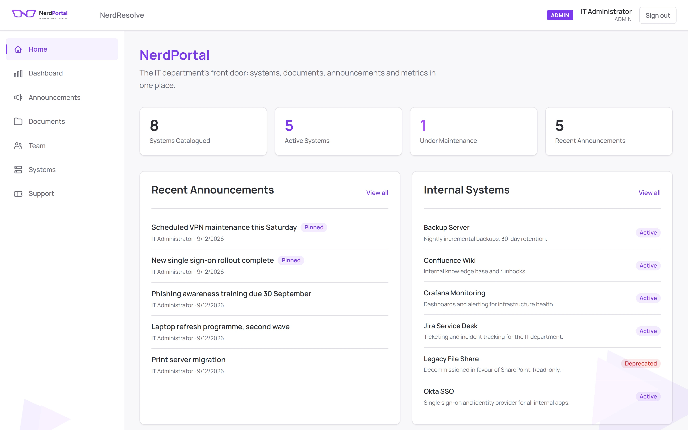
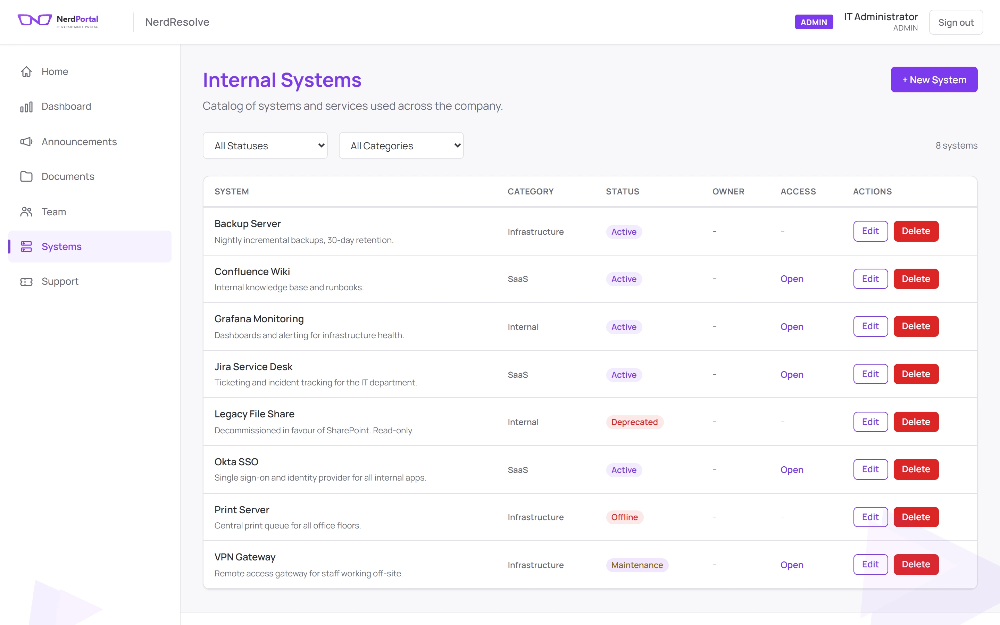
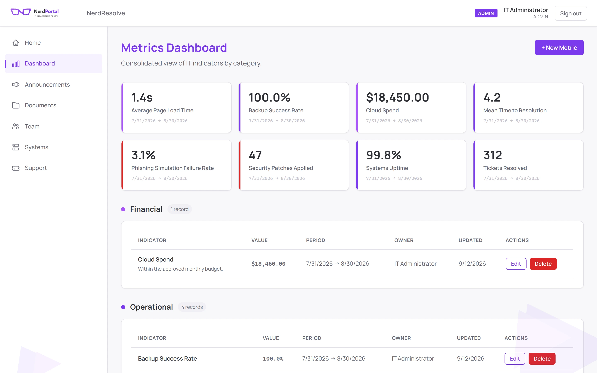
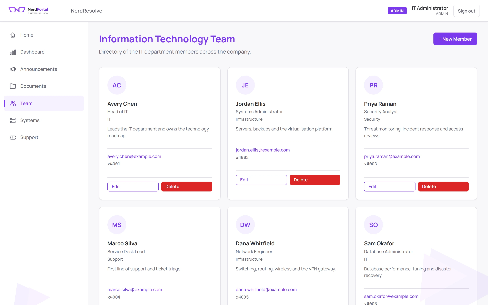
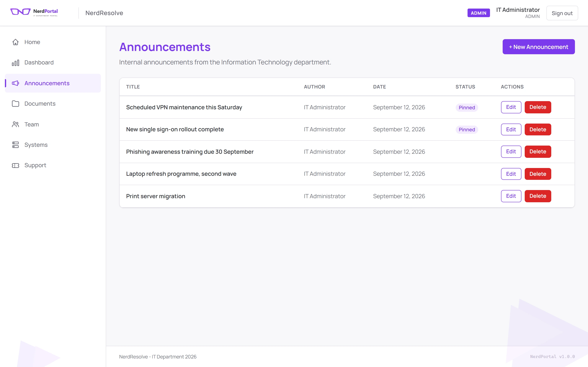
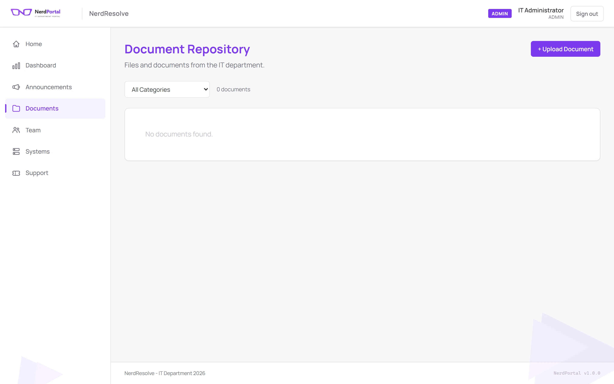
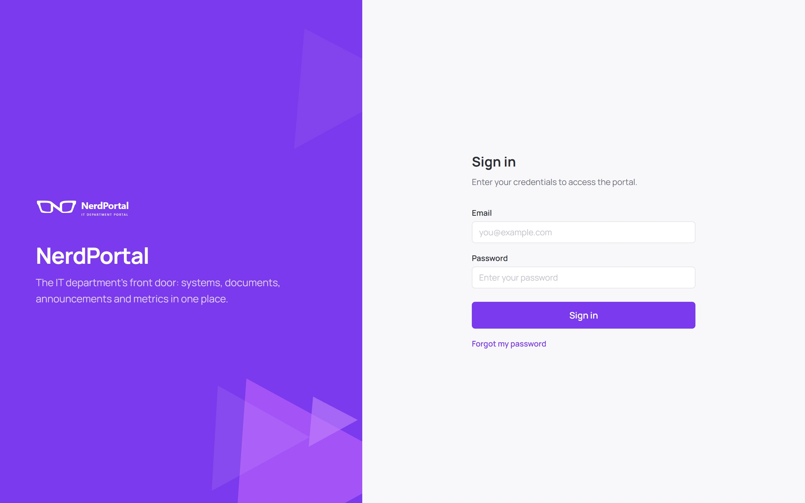

<div align="center">



The intranet the IT department never gets around to building: systems,
documents, announcements and metrics on one page, readable by everyone without
a login.

[](LICENSE)   

[The screens](#the-screens) · [How it works](#how-it-works) · [Run it](#run-it) · [Make it yours](#make-it-yours) · [Configure](#configure) · [Security](#security) · [License](#license)

</div>

---

## What it is

Every IT department ends up answering the same four questions over and over.
*Which system do I use for that? Where is the VPN document? Is the printer down
again? Who do I email about access?* The answers exist — scattered across chat
threads, a wiki nobody updates and one person's memory.

NerdPortal puts them on one page. Anyone in the company can read it without an
account: the system catalogue with live status, the document repository, the
announcements and the team directory. Only writing requires a login, so the
portal stays current without becoming a second job.

<div align="center">

</div>

---

## The screens

<table>
<tr>
<td width="50%"><br><sub><b>Systems</b> · every internal tool, its status and who owns it</sub></td>
<td width="50%"><br><sub><b>Metrics</b> · KPIs grouped by category, with the period they cover</sub></td>
</tr>
<tr>
<td width="50%"><br><sub><b>Team</b> · who does what, and how to reach them</sub></td>
<td width="50%"><br><sub><b>Announcements</b> · pinned items stay at the top</sub></td>
</tr>
<tr>
<td width="50%"><br><sub><b>Documents</b> · uploads with category, size and uploader</sub></td>
<td width="50%"><br><sub><b>Sign in</b> · only needed to change something</sub></td>
</tr>
</table>

> These aren't mockups. It's the application running against a seeded database,
> photographed with a headless browser.

---

## How it works

The whole product is one idea: **public read, restricted write**.

```
GET  /api/v1/systems        no session        anyone can read
GET  /api/v1/announcements  no session
GET  /api/v1/documents      no session
     │
POST/PUT/DELETE             session + role    only an admin can write
     │
[1] session cookie          httpOnly, SQLite-backed store
     │
[2] CSRF double-submit      cookie + X-CSRF-Token header must match
     │
[3] role check              requireRole("admin")
     │
[4] audit log               who, what, when, from which IP
```

### Three decisions worth recording

**Reading needs no account.** The alternative — putting the whole intranet
behind a login — is what kills these portals: people stop checking it because
the friction beats the benefit. Here the content is public to the network and
only mutation is gated, so the reason to visit survives.

**SQLite, not Postgres.** An IT portal for one company is a handful of tables
read by a few hundred people. A database server would be one more thing to back
up, patch and monitor for no measurable gain. The whole database is a file on a
Docker volume; backing it up is `cp`.

**The CSRF cookie is `SameSite=Lax`, deliberately.** The frontend (`:3000`) and
the API (`:4000`) are different origins in the default layout, and `Strict`
would stop the browser from ever sending the cookie back — login would fail
with a 403 that looks like a wrong password. Protection comes from the
double-submit itself: an attacker's page cannot *read* the cookie to echo it in
the header. Set `COOKIE_SAMESITE=none` (HTTPS only) if you split the two across
unrelated domains.

---

## Run it

You need **Docker**. Nothing else — Node, the database and the build all live
in the containers.

```bash
git clone https://github.com/nerdresolve/NerdPortal.git
cd NerdPortal
cp .env.example .env
```

Two values in `.env` have no default, and the stack will not start without
them:

```bash
# a random string, 64+ characters
SESSION_SECRET=$(openssl rand -hex 32)
# the first admin's password — there is no built-in default
ADMIN_SEED_PASSWORD=choose-something-long
```

Then:

```bash
cd docker
docker compose --env-file ../.env up -d --build
```

The portal comes up at **http://localhost:3000**, the API at
**http://localhost:4000**. Sign in with `admin@example.com` and the password
you just set.

```bash
docker compose logs -f backend
curl -s http://localhost:4000/api/v1/health
```

```json
{ "success": true, "data": { "status": "ok", "timestamp": "..." } }
```

### Without Docker, for development

```bash
cd apps/backend  && npm install && npm run migrate && npm run dev
cd apps/frontend && npm install && npm run dev
```

`better-sqlite3` compiles a native module, so this path needs a C++ toolchain
(`build-essential` on Debian, Xcode CLT on macOS, Visual Studio Build Tools on
Windows). If that sounds like a bad afternoon, use Docker.

### Tests

```bash
cd apps/backend && npm install && npm test
```

120 tests covering authentication, authorization, CSRF, session storage, upload
path traversal, XSS sanitizing and the full password-reset flow.

---

## Make it yours

The portal should wear your face, not NerdResolve's. **One file does it:**
[`apps/frontend/brand.config.js`](apps/frontend/brand.config.js).

```js
const brand = {
  name: "NerdPortal",
  organization: "NerdResolve",
  tagline: "The IT department's front door...",

  logo: "/logo.svg",
  favicon: "/favicon.svg",

  colors: {
    primary: "#7C3AED",     // buttons, links, headings, active nav
    accent:  "#A855F7",     // badges, chart accents
    // ...semantic and neutral colors
  },

  fonts: { primary: '"Manrope", ...' },

  support: { email: "it@example.com", phone: "...", hours: "..." },
};
```

Every color becomes a CSS custom property at render time, so changing `primary`
repaints buttons, links, headings, focus rings, badges, the active sidebar item
and the login panel together. There is no stylesheet to hunt through.

| To change | Do this |
|---|---|
| Name in the header, tab title, emails | `name` and `organization` |
| Every accent color in the UI | `colors.primary` and `colors.accent` |
| The logo | replace `apps/frontend/public/logo.svg` (and `logo-dark.svg` for the login panel) |
| The favicon | replace `apps/frontend/public/favicon.svg` |
| Typeface | `fonts.primary`, plus the `<link>` in `pages/_document.js` if it is a webfont |
| Support contact on the Support page | the `support` block |

The values shipped in the file are NerdResolve's own identity — that is the
"vanilla" look in the screenshots above.

---

## Configure

Everything else comes from the environment. No credential has a default in the
code, and `.env` is gitignored.

| Variable | Required | What it is |
|---|---|---|
| `SESSION_SECRET` | yes | Session signing key, 64+ random characters |
| `ADMIN_SEED_PASSWORD` | yes | First admin's password. Empty = the seed refuses to run |
| `ADMIN_SEED_EMAIL` | — | Defaults to `admin@example.com` |
| `ADMIN_SEED_NAME` | — | Defaults to `IT Administrator` |
| `SQLITE_DB_PATH` | — | Ignored under Docker (always `/data/nerdportal.db`) |
| `BCRYPT_ROUNDS` | — | Password hashing cost. Default `12` |
| `COOKIE_SAMESITE` | — | `lax` (default), or `none` for unrelated domains over HTTPS |
| `COOKIE_SECURE` | — | `false` (default). Set `true` once you are behind HTTPS |
| `ALLOWED_ORIGINS` | — | Extra CORS origins, comma separated |
| `FRONTEND_URL` | — | Used to build the link in reset emails |
| `NEXT_PUBLIC_API_URL` | — | API URL the **browser** calls |
| `INTERNAL_API_URL` | — | API URL the Next.js server calls during SSR |
| `SMTP_HOST` `SMTP_PORT` `SMTP_USER` `SMTP_PASSWORD` `SMTP_FROM_EMAIL` | for reset | Password recovery stays disabled until these are set |
| `PASSWORD_RESET_CODE_TTL_MINUTES` | — | Code lifetime. Default `15` |
| `PASSWORD_RESET_MAX_ATTEMPTS` | — | Wrong codes before lockout. Default `5` |

---

## Under the hood

```
apps/
  backend/
    src/server.js       middleware order: helmet, CORS, session, XSS, CSRF, routes
    routes/             one file per resource, role guards declared here
    controllers/        request shape in, response shape out
    dal/                every SQL statement lives here, parameterized
    middlewares/        auth, csrf, rateLimit, securityHeaders, upload, xssSanitizer
    services/           email (hand-rolled SMTP), password reset, uploads
    tests/              120 unit + integration tests
  frontend/
    brand.config.js     >>> the one file you edit to rebrand <<<
    components/         Header, Sidebar, Footer, Layout, BrandStyles
    pages/              one file per screen
    styles/             CSS modules + globals.css (design tokens)
database/
  migrations/           numbered, idempotent, applied in order
  seeds/                the first admin, and nothing else
```

The `dal/` boundary is what keeps SQL out of the controllers: every query is a
prepared statement with bound parameters, so a route handler has no way to
build a string that reaches the database.

---

## Security

What is actually implemented, so you can judge it rather than trust a badge:

- **Passwords** — bcrypt, cost 12, never logged. Minimum 12 characters with
  upper, lower and a digit, enforced server-side.
- **Sessions** — httpOnly cookie, 8-hour rolling expiry, stored in SQLite
  (survives a restart; revocable by deleting a row).
- **CSRF** — double-submit token on every non-GET request.
- **Rate limiting** — per-IP on login and on each password-reset step.
- **Uploads** — extension and MIME allowlist, size cap, filenames sanitized,
  and every resolved path checked to be inside the uploads directory before a
  write. Path traversal is covered by tests.
- **XSS** — request bodies sanitized on the way in; credential fields are
  exempted deliberately (they are compared as opaque values, never rendered).
- **Headers** — helmet, with `X-Frame-Options: DENY` and `nosniff` on the
  frontend too.
- **Audit log** — every mutation records actor, action, target and IP.

**Set `COOKIE_SECURE=true` in production.** It ships `false` so a first run
over plain HTTP can actually sign in — a `Secure` cookie is silently dropped
without TLS, which looks exactly like a wrong password. Once you have HTTPS in
front, turn it on; until then session cookies cross the network in the clear.

**What it does not do.** There is no SSO or LDAP integration; accounts are
local. There is no per-record permission model — a role is `admin`, `editor` or
`viewer`, and that is the whole matrix.

---

## Known limitations

- **SQLite means one writer.** Fine for a few hundred readers and a handful of
  editors; not a choice for a portal serving tens of thousands.
- **Uploads live on a Docker volume**, not object storage. Back up the volume.
- **The UI ships in English only.** Strings are inline in the components —
  there is no i18n layer yet.
- **Dates are formatted `en-US`** and rendered from date-only values, so a
  period can read one day off in timezones far from UTC.

---

## License

MIT. Use it, fork it, sell it, rebrand it — see [LICENSE](LICENSE).

Built by [NerdResolve](https://github.com/nerdresolve).
